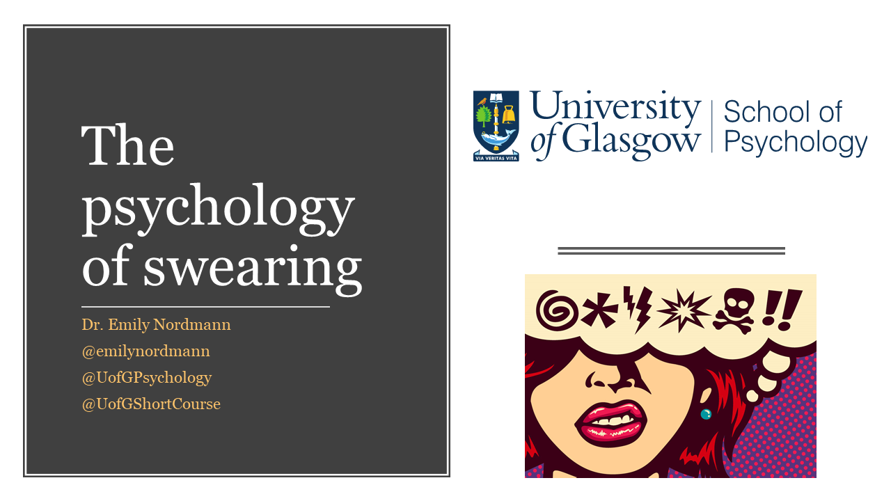

```{r setup, include=FALSE, echo=FALSE, warning=FALSE, message=FALSE}
knitr::opts_chunk$set(echo = TRUE)
library(tidyverse)
library(wordcloud)
library(tidytext)
library(lsr)
library(gridExtra)
library(ggforce)
library(afex)
library(emmeans)
dat <- read_csv("data.csv")
```

```{r, echo = FALSE, message=FALSE, warning=FALSE}
dat2 <- rename(dat,
              age = `Age (in whole years)`,
              gender = Gender,
              letter = `Please write as many words as you can beginning with the letter "A".`, 
              animal = `Please write down as many different types of animal as you can.`,
              swears = `Please write down as many swear words as you can.`) %>%
  select(-Timestamp) %>%
  mutate(subject = row_number()) %>%
  mutate(age = as.numeric(age),
         gender = as.factor(gender),
         subject = as.factor(subject)) %>%
  select(subject,everything()) %>%
  mutate(gender = fct_relevel(gender, c("Man", "Woman", "Other")))
  

# convert to tidytext and calculate number of words in each category

dat_letter <- dat2 %>%
  select(subject, letter) %>%
  unnest_tokens(input = letter, output = words) %>%
  mutate(type = "letter")
 

dat_animal <- dat2 %>%
  select(subject, animal) %>%
  unnest_tokens(input = animal, output = words) %>%
  mutate(type = "animal")

dat_swears <- dat2 %>%
  select(subject,gender, swears) %>%
  unnest_tokens(input = swears, output = words) %>%
  mutate(type = "swear")

all_dat <- bind_rows(dat_animal, dat_letter, dat_swears)

all_counts <- all_dat %>%
  group_by(subject, type) %>%
  summarise(score = length(words)) %>%
  inner_join(dat2, by = "subject") %>%
  select(subject:gender) %>%
  ungroup()

```

<center>



</center>

This website accompanies the Psychology of Swearing talk held on Friday 30th August 2019 as part of the University of Glasgow Short Course series. 

## Reading list

If you would like more information about anything presented in this talk, I recommend the following sources:

**Books**

* Benjamin Bergen – What the F: What Swearing Reveals About Our Language, Our Brains, and Ourselves. [Amazon link.](https://www.amazon.co.uk/What-Swearing-Reveals-Language-Ourselves/dp/0465060919/ref=sr_1_1?keywords=what+the+f&qid=1566551272&s=gateway&sr=8-1)
* Steven Pinker - The Stuff of Thought. [Amazon link.](https://www.amazon.co.uk/Stuff-Thought-Language-Window-Nature/dp/0141015470/ref=sr_1_1?keywords=stuff+of+thought&qid=1566551312&s=books&sr=1-1)
* Emma Byrne - Swearing is Good For You. [Amazon link.](https://www.amazon.co.uk/Swearing-Good-You-Amazing-Language/dp/1781255776/ref=pd_bxgy_14_img_2/259-8432264-9279917?_encoding=UTF8&pd_rd_i=1781255776&pd_rd_r=525277f1-261c-4f4c-acc4-93a7a7c5ee3a&pd_rd_w=szHk5&pd_rd_wg=7Gg4N&pf_rd_p=7a9d3b22-47b7-4932-be38-57f4219c3325&pf_rd_r=XHYRBT8TNV0FPTX4W5F4&psc=1&refRID=XHYRBT8TNV0FPTX4W5F4)

**Websites**

https://stronglang.wordpress.com/   
https://twitter.com/stronglang 
 
**Journal papers**

Where possible I've tried to use open-access links but if you run into paywall issues, e-mail emily.nordmann@glasgow.ac.uk and I’ll send you a copy.

[Feldman, G., Lian, H., Kosinski, M., & Stillwell, D. (2017) Frankly, we do give a damn: The relationship between profanity and honesty. Social Psychological and Personality Science](https://journals.sagepub.com/doi/pdf/10.1177/1948550616681055)

[Harris, C. L., Aycicegi, A., & Gleason, J. B. (2003). Taboo words and reprimands elicit greater autonomic reactivity in a first language than in a second language. Applied Psycholinguistics, 24(04), 561-579.](http://www.bu.edu/psych/charris/papers/BilingualTaboo.pdf)

[Jay, T. (2009). The utility and ubiquity of taboo words. Perspectives on Psychological Science, 4(2), 153-161.](https://journals.sagepub.com/doi/pdf/10.1111/j.1745-6924.2009.01115.x?casa_token=A7WjxTkaJ64AAAAA:Xf81MCDxjccBGgUjvQgvd_yhJrSyiCOIwR_EZvXYGQQbUtZBOdbIzpHb794LydeBbeYBARUaTGI)

[Jay, T., & Janschewitz, K. (2008). The pragmatics of swearing. Journal of Politeness Research. Language, Behaviour, Culture, 4(2), 267-288.](http://mcla.edu/Assets/MCLA-Files/Academics/Undergraduate/Psychology/Pragmaticsofswearing.pdf)

[Jay, K. L., & Jay, T. B. (2013). A child's garden of curses: A gender, historical, and age-related evaluation of the taboo lexicon. The American Journal of Psychology, 126(4), 459-475.](https://www.jstor.org/stable/pdf/10.5406/amerjpsyc.126.4.0459.pdf?casa_token=nSA0bVdGjUgAAAAA:Rr0kY0ga3Y7kmWf_UurgmWbcdTmevy3ZvKjCP0El6TpfLgjmWAYduNAGUGv0suEJtx2sFO4b70to8T2PNWkFlqUoysi4OH3EXIx9k0Q0fNKqlFiQAw)

[Jay, K. L., & Jay, T. B. (2015). Taboo word fluency and knowledge of slurs and general pejoratives: deconstructing the poverty-of-vocabulary myth. Language Sciences, 52, 251-259.](https://mcla.edu/Assets/MCLA-Files/Academics/Undergraduate/Psychology/fluency%202015.pdf)

[Mackay, D. G., Shafto, M., Taylor, J. K., Marian, D. E., Abrams, L., & Dyer, J. R. (2004). Relations between emotion, memory, and attention: Evidence from taboo Stroop, lexical decision, and immediate memory tasks. Memory & Cognition, 32(3), 474-488.](https://link.springer.com/content/pdf/10.3758/BF03195840.pdf)

[Stephens, R., Atkins, J., & Kingston, A. (2009). Swearing as a response to pain. Neuroreport, 20(12), 1056-1060.](https://journals.lww.com/neuroreport/fulltext/2009/08050/Swearing_as_a_response_to_pain.4.aspx?casa_token=IExQah25ENMAAAAA:0oQmTes-0aMhrvX8kdgm-fZ-xkSbS_ZWgf4UWQUJ9RgyRJ168leqaxeDBi-h3kJ0j4fNf999UcDv2QC31mm_DChpvVNi)

[Van Lancker, D., & Cummings, J. L. (1999). Expletives: Neurolinguistic and neurobehavioral perspectives on swearing. Brain research reviews, 31(1), 83-104.](https://steinhardt.nyu.edu/scmsAdmin/media/users/drv1/1999_Expletives_neurolinguistic_and_neurobehavioral_persp.pdf)


## Relationship between age and vocabulary


```{r, echo = FALSE}
corr_dat <- as.data.frame(all_counts %>%
  spread(key = type, value = score) %>%
    select(age, animal, swear))

vocab_corr <- correlate(corr_dat, test = TRUE, p.adjust.method = "holm")
vocab_corr
```

The correlation between age and animals is r = `r vocab_corr$correlation[1,2] %>% round(2)`, p = `r vocab_corr$p.value[1,2] %>% round(3)`. 

The correlation between age and swears is r = `r vocab_corr$correlation[1,3] %>% round(2)`, p = `r vocab_corr$p.value[1,3] %>% round(3)`. 

The correlation between swears and animals is r = `r vocab_corr$correlation[3,2] %>% round(2)`, p = `r vocab_corr$p.value[3,2] %>% round(3)`. 

```{r, echo = FALSE, fig.align="center"}
corr_dat %>%
  na.omit() %>%
  ggplot() +
  geom_point(aes(x = .panel_x, y = .panel_y)) +
  geom_autodensity() +
  facet_matrix(vars(age, animal, swear), layer.diag = 2) +
  theme_bw()
```


## Vocabulary scores by gender

### General fluency

```{r, echo=FALSE, fig.align="center"}
all_counts %>%
  filter(type == "animal") %>%
  drop_na(gender) %>%
  group_by(gender) %>%
  summarise(average_score = mean(score, na.rm = TRUE)) %>%
  knitr::kable(align = 'c', digits = 2)  

```

<br>

```{r, echo = FALSE, fig.align="center"}
all_counts %>%
  filter(type == "animal") %>%
  drop_na(gender) %>%
  ggplot(aes(x = gender, y = score, fill = gender)) +
  geom_violin(trim = FALSE, alpha = .5, show.legend = FALSE) +
  geom_boxplot(show.legend = FALSE, alpha = .7, width = .2) +
  theme_minimal() +
  scale_fill_viridis_d(option = "E")
```

### Swearing

```{r, echo=FALSE}
all_counts %>%
  filter(type == "swear") %>%
  drop_na(gender) %>%
  group_by(gender) %>%
  summarise(average_score = mean(score, na.rm = TRUE)) %>%
  knitr::kable(align = 'c', digits = 2)  

```

<br>

```{r, echo = FALSE, fig.align="center"}
all_counts %>%
  filter(type == "swear") %>%
  drop_na(gender) %>%
  ggplot(aes(x = gender, y = score, fill = gender)) +
  geom_violin(trim = FALSE, alpha = .5, show.legend = FALSE) +
  geom_boxplot(show.legend = FALSE, alpha = .7, width = .2) +
  theme_minimal() +
  scale_fill_viridis_d(option = "E")
```

## Most frequent swear words

```{r, echo = FALSE, fig.align="center"}
dat_swears%>%
  na.omit()%>%
  count(words, sort = TRUE)%>%
  head(10) %>%
  mutate(percent = n/sum(n)*100) %>%
  mutate(words = reorder(words, percent))%>%
  ggplot(aes(x = words, y = percent, fill = words))+
  geom_col(show.legend = FALSE)+
  coord_flip() +
  scale_fill_viridis_d(option = "D")
```

## Word cloud

```{r, echo = FALSE, message = FALSE, warning  = FALSE, fig.align="center"}
swears <- all_dat %>%
  filter(type == "swear")

wordcloud(words = swears$words, max.words = 90, min.freq = 1)
```

## Most frequent words by gender

```{r, echo = FALSE, message = FALSE, warning  = FALSE, fig.align="center"}
dat_swears%>%
  na.omit()%>%
  group_by(gender) %>%
  count(words, sort = TRUE)%>%
  top_n(10) %>% 
  mutate(percent = n/sum(n)*100) %>%
  ungroup() %>%
  mutate(words = reorder_within(words, percent, gender)) %>%
  ggplot(aes(x = words, y = percent, fill = words))+
  geom_col(show.legend = FALSE)+
  coord_flip() +
  scale_fill_viridis_d(option = "E") +
  facet_wrap(~gender, scales = "free_y") +
  scale_x_reordered()
```

## Word cloud - men
```{r, echo = FALSE, fig.align="center", warning = FALSE, message = FALSE}
swears_man <- swears %>%
  filter(gender == "Man")

swears_woman <- swears %>%
  filter(gender == "Woman")

swears_other <- swears %>%
  filter(gender == "Other")
  
wordcloud(words = swears_man$words, max.words = 90, min.freq = 1)

```

## Word cloud - women

```{r, echo = FALSE, fig.align="center", warning = FALSE, message = FALSE}
wordcloud(words = swears_woman$words, max.words = 90, min.freq = 1)
```

## Word cloud - non-binary/other

```{r, echo = FALSE, fig.align="center", warning = FALSE, message = FALSE}
wordcloud(words = swears_other$words, max.words = 90, min.freq = 1)
```
